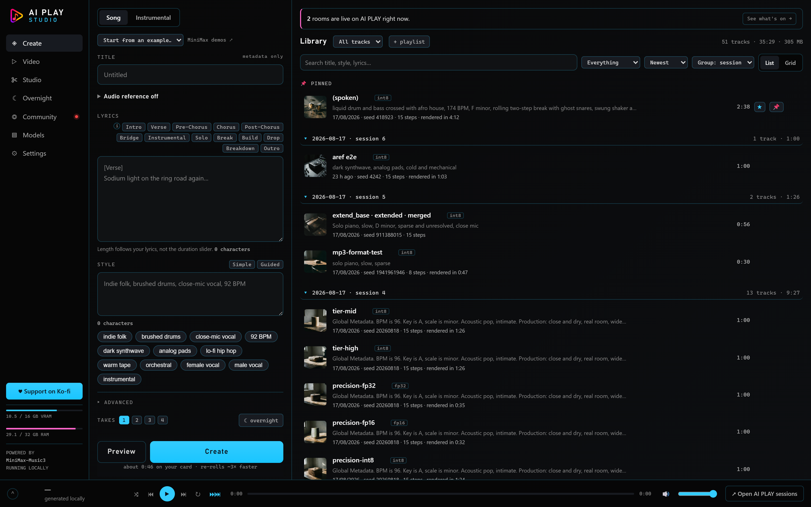
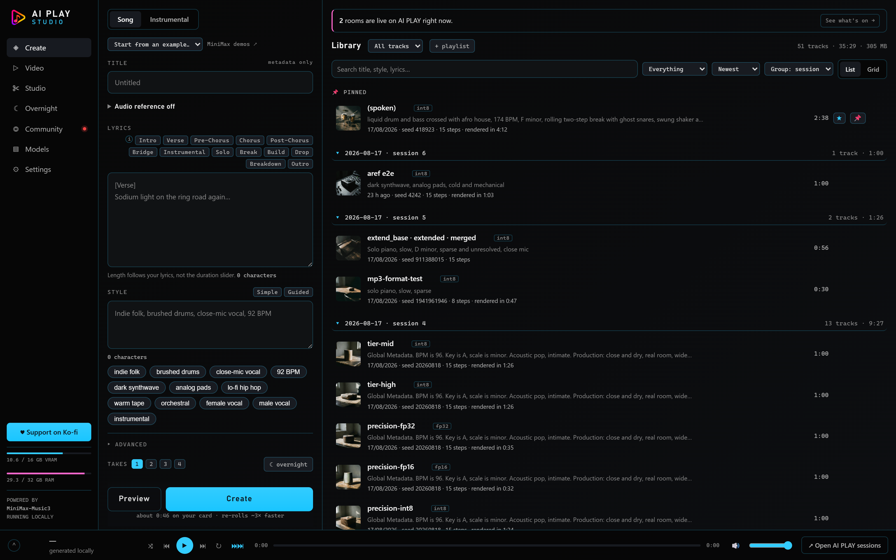
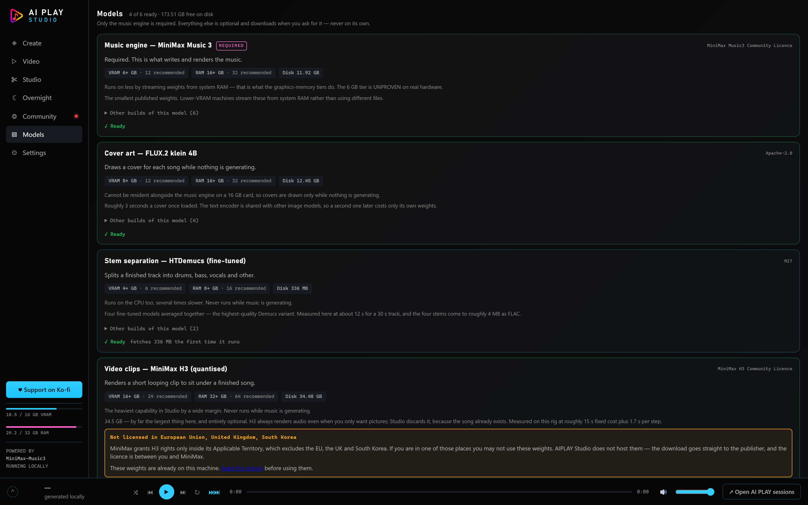
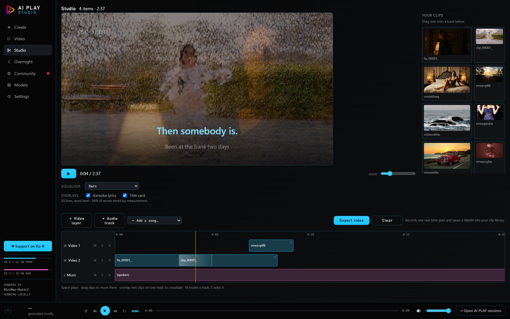
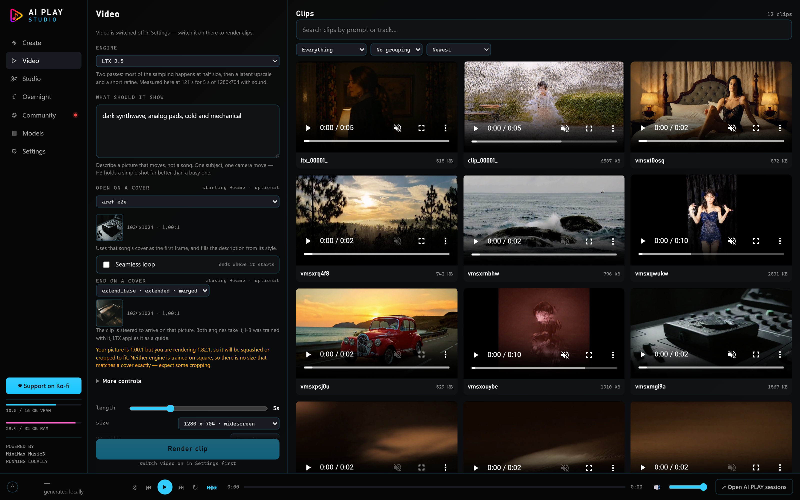

<!--
DRAFT — not published. Every number below traces to a file in this repo or to a
measurement script in scripts/. Anything I could not verify is marked
[TODO: verify] rather than rounded into a claim.
Screenshot/audio/video capture is someone else's job — placeholders are marked.
-->

## The Number That Started This

A three-minute song, generated locally, on a card most people would call mid-range.

**Twenty-eight minutes.**

That was my first honest measurement, and I nearly killed the project over it. Local music generation is *supposed* to be the slow, principled option — you trade speed for owning your own output — but twenty-eight minutes is not a trade. It's a hobby with extra steps.

Same card. Same model. Same weights, byte for byte. Today it takes **four and a half minutes**.

Nothing in that gap is a quality compromise. I want to be crystal clear about that up front, because "we made it fast" usually means "we made it worse and hoped you wouldn't notice." Every single change below was A/B'd against a converged reference or listened to on purpose, and one of them made things *slower* deliberately. I'll get to that one.


*Write a caption and some lyrics. That is the whole interface.*

---

## What AIPLAY Studio Actually Is

Write a style description and some lyrics. Get a song. On your own machine.

No account. No upload. No credits. No per-song cost. Nothing leaves the building.

That's the whole pitch, and everything else in this post is in service of it:

- **Music** — full songs from a caption and lyrics, or instrumentals from a structure.
- **Re-roll the mix** — same performance, new render, in about 15 seconds.
- **Extend, branch and merge** takes into one song.
- **Start from an existing song** — this is the interesting one, see below.
- **Cover art**, drawn automatically while the GPU is otherwise idle.
- **Stems and timed lyrics** for visualizers and remixes.
- **Video clips** under a finished track.
- **Overnight runs** — a list of ideas, N takes each, a full library by morning.


*The library, grouped into sessions. Covers are drawn while the card is idle.*

Post-processing never competes with music. Covers, stems and lyrics run only when the queue is empty, and a new song preempts them. That's a rule, not a setting.

---

## It Ships No Models. That Is Deliberate.

This part matters more than the features, so it goes before them.

**AIPLAY Studio contains no model weights and redistributes none.** Not one byte. Every capability *declares* what it needs — in `server/models.js`, which you can read — and downloads it from the publisher, at your request, on your machine.

Before anything downloads, the Models screen tells you four things: the real byte count, the license, what it wants from your hardware, and whether your card can run it. Then there's one button.

| Capability | Download | License |
|---|---|---|
| Music engine — MiniMax Music 3 | 11.9 GB | MiniMax Music3 Community |
| Cover art — FLUX.2 klein 4B | 12.5 GB | Apache-2.0 |
| Stem separation — HTDemucs | 336 MB | MIT |
| Timed lyrics — Whisper large-v3 | 3.1 GB | MIT |
| Video clips — MiniMax H3 | 34.5 GB | MiniMax H3 Community ⚠ |
| Video clips — LTX 2.5 | 39.7 GB | LTX-2.x Community ⚠ |

Two of those carry warnings, and Studio shows them as blocking acknowledgements rather than footnotes:

- **MiniMax H3** grants rights only inside its Applicable Territory, which **excludes the EU, the UK and South Korea**. If you're in one of those places, you may not use those weights. Studio refuses the download without an explicit acknowledgement.
- **LTX 2.5** has no territory restriction, but requires a paid agreement for entities at **USD 10,000,000 annual revenue or more**, and forbids use in a product competing with Lightricks' own. Its repo is access-gated, so you accept the license on the model page and fetch it with your own token — the built-in downloader deliberately has nowhere to keep one.

**Only the music engine is required.** Everything else is optional and the app is fully usable without any of it.


*Nothing downloads until you ask. The size and the licence are on screen first.*

The license on the weights is between you and the publisher. Studio hosts nothing, proxies nothing, and mirrors nothing. That isn't legal caution dressed up as a feature — it's the only arrangement that's honest.

Studio itself is Apache-2.0.

---

## It's a Face on ComfyUI, and It Says So

Everything AIPLAY Studio does, it does by submitting a graph to [ComfyUI](https://github.com/comfyanonymous/ComfyUI) over its HTTP API.

**Not linked. Not bundled. Not modified.** ComfyUI is GPL-3.0 and a separate program, running as its own process, exactly as its authors shipped it. Studio starts one, talks to it over HTTP, and stops it again.

You install ComfyUI yourself. That's a real cost and I'm not going to pretend otherwise — but ComfyUI is gigabytes of Python before a single weight, it updates on its own schedule, and most people who want this already have one.

The upside is that **the graphs are the product**. The four pipelines Studio actually submits are in `workflows/` as ordinary ComfyUI JSON, exported straight from the code that builds them. Drag one onto the ComfyUI canvas and every value is right there.

And those values are not ComfyUI's defaults. They were arrived at by measurement, the measurement scripts ship in `scripts/`, and that tuning is most of what Studio knows. It's yours the moment you open the files.

A claim nobody can re-run is just an assertion.

---

## Installing It

The story is a zip and a launcher.

1. **Node.js** — the LTS installer, about 30 MB.
2. **ComfyUI** — the Windows portable NVIDIA build is the easy route. Run it once on its own before going near Studio; that first launch is what proves your card, your driver and PyTorch actually agree with each other, and it's far easier to read that failure in ComfyUI's own window.
3. **Double-click `Start AIPLAY Studio.cmd`.**

That's it. On first run it fetches exactly one npm package (`ws`, MIT — that's the entire dependency list), hunts for your ComfyUI across every drive, and opens your browser at `http://127.0.0.1:4173`.

It's a fifteen-line batch file rather than an `.exe` on purpose. You can open it in Notepad and read exactly what it's about to do before you let it do it.

Full walkthrough, including the five things that actually go wrong on a first run, is in [INSTALL.md](../INSTALL.md).

---

## What Your Machine Needs

Music and video are two completely different questions, so here are two answers.

Everything below was measured on an **RTX 4070 Ti SUPER (16 GB), 32 GB of RAM, Windows 11**. Your numbers will differ; the ratios shouldn't.

### For music

| | |
|---|---|
| **GPU** | NVIDIA, 6 GB VRAM minimum, 12 GB recommended |
| **System RAM** | 16 GB minimum, 32 GB recommended |
| **Disk** | 12 GB |

**There is no CPU fallback.** The model's first stage requires CUDA and stops with `Expected a cuda device, but got: cpu`. AMD, Intel and Apple graphics will not run this, and macOS is out for that reason rather than a packaging one.

The weights Studio uses are already the smallest published versions, so fitting a smaller card isn't done by shrinking the model — there's nothing smaller to switch to. It's done by keeping less of it resident and streaming the rest from system RAM. That's what the graphics-memory tiers do:

| Your VRAM | What happens |
|---|---|
| 6 GB | Streams almost everything from RAM. Much slower. ⚠ **Unproven on real 6 GB hardware** — simulated on a 16 GB card with a reserved-VRAM budget. |
| 8 GB | Works. Roughly 2× slower than a large card. ⚠ Also simulated. |
| 12 GB | Verified **bit-identical** output to the fast path. |
| 16 GB+ | Fastest. The model stays resident. |

I'd rather say "unproven" than publish a minimum-VRAM claim I haven't actually seen fail or hold. If you run it on a real 6 GB card, I want to hear about it.

### For video

| | |
|---|---|
| **GPU** | 16 GB VRAM **minimum** — for either engine |
| **System RAM** | 32 GB minimum |
| **Disk** | 34.5 GB (MiniMax H3) or 39.7 GB (LTX 2.5) |

Video and cover art are never resident alongside the music engine on a 16 GB card. That is exactly why they wait for idle time rather than fighting for the card.

### What "fast" means, measured

| | On the 16 GB card |
|---|---|
| Engine cold start | ~15 s |
| A fresh song | 39 s of audio in 65 s — **1.66× realtime** |
| A full-length render | 135 s of audio in ~207 s — **~1.5× realtime** |
| Re-rolling the mix | **50 s → 15 s** |
| A cover | ~3 s |
| Stems for a 30 s track | ~12 s |
| Timed lyrics for a 2.5-minute song | ~36 s |
| A 5-second video clip — LTX 2.5, 1280×704 | **121 s** |
| The same clip — MiniMax H3, 1344×768 | 308 s at 8 steps, **660 s at 20** |

---

## The Extras, In Plain Language

**Stem separation (HTDemucs).** Splits a finished track into drums, bass, vocals and other — four separate files you can drop into a DAW. Off by default, because separating everything is wasteful: most takes get discarded, and the ones worth pulling apart are exactly the ones you already starred.

**Timed lyrics (Whisper large-v3 → LRC).** Listens back to the rendered song and writes two `.lrc` files: one line-level, one word-level. That's what a kinetic-lyrics visualizer eats. It separates the vocal stem first when the mix is dense, because it measurably helps.

And here's the honest part: **line-level timing is reliable, word-level is approximate.** A word held across two bars has no single onset, so there's no correct answer to snap to. The UI says so, because presenting the word file as exact would be a lie with a timestamp on it.


*The studio: two clips overlapping into a crossfade, with the word-level karaoke the .lrc drives.*

**Cover art (FLUX.2 klein 4B).** Reads the song's own caption and draws a cover, in about three seconds, while nothing else is using the GPU.

Two things about that prompt are load-bearing and both were learned the hard way:

- It **never** says "album cover." That phrase summons the album-cover *convention*, which includes a title, and the model renders garbled lettering across the top. Framing it as a photograph removes the problem at the source.
- It **never** stacks "minimalist" + "restrained palette" + "generous negative space." Those compound into literal emptiness — on an abstract caption like "dark synthwave, analog pads" the first draft returned a black frame with a grey corner and no subject at all. Genre words aren't visual nouns, so the prompt has to demand a tangible object.

The *style* half of that prompt never changes; only the subject does. Fifty freely-generated covers clash with each other and turn a library into noise.

⚠ **The rough edges, stated plainly:** stems and timed lyrics are Python packages, not files Studio can fetch, and they deliberately run in a *different* Python from the engine. On a fresh machine they won't work until you install them somewhere and point Studio at that interpreter. Everything else in the install is smoother than this part.

That separation isn't untidiness, it's the whole point — and it leads directly into the next section.

---

## Loops, and the Two Frames That Make Them

Loop videos are the thing our community actually makes, and the way you make one
is boring: **end on the picture you started from.** The clip has nowhere to go
but back to its own first frame, so it cuts to the start with no seam.

Both engines have taken a `last_frame` since the day they were wired up. For a
long time you could not *reach* it except by ticking "seamless loop", which
forced the closing frame to equal the opening one — so "travel from this picture
to that one" was a thing the graph could do and the UI could not ask for. There
are now two selectors, and both show you the picture you picked, because a
dropdown of song titles is not a picture.


*Starting frame and closing frame, each previewed, with the shape warning underneath.*

There was a worry here worth repeating, because it is real and it is usually
true: **a lot of models freeze when both ends are the same.** They satisfy the
constraint by simply not moving. This one does not, and the reason is a number
rather than a virtue — the end frames are pinned at **strength 0.7**, not 1.0. At
1.0 the ends dominate and the middle stalls. Measured on the shipped setting:
motion 1.90, mid-point divergence 6.00, loop closure 1.62. It moves, and it still
arrives. The dial is exposed, and it defaults to what was measured rather than to
the round number.

Picking a frame surfaced something else nobody could see. **Covers are square.
Every render size either engine offers is 16:9 or 9:16** — deliberately, because
that is what they are trained on. So a cover handed over as a first frame is
always the wrong shape and gets squashed or cropped, silently. Studio now says so.

One small thing I got wrong on the way and had to fix: the first version compared
aspect ratios by subtracting them. Linearly, a square (1.00) looks *closer* to
9:16 (0.55) than to 16:9 (1.82) — 0.45 away versus 0.82 — so it cheerfully
recommended rendering your video sideways. But 1 ÷ 1.82 = 0.55. Those are the
same shape turned on its side, and they crop a square by exactly the same amount.
Aspect ratios compare in log space. `|ln(a/b)|` knows that; subtraction doesn't.

---

## A Small Editor, Because the Clips Had Nowhere to Go

You could make clips and you could make songs and there was no way to put them
together. So there's now a Studio tab, and it is shaped like Vegas on purpose —
stacked tracks, clips you drag along a ruler, mute and solo per track.

The one behaviour worth copying from Vegas is that **a crossfade is an overlap.**
You don't select a junction and type a duration; you slide one clip on top of the
end of another and the dissolve is there. There is no crossfade control in the UI
for the same reason there isn't one in Vegas: the timeline already says it.


*Two clips overlapping on one layer, a third on the layer above, the song underneath.*

On top of that: a karaoke overlay driven by the `.lrc` Studio already generates
(word level where the alignment is confident — the track above is 98% timed by
measurement rather than interpolated), and a Vizzy-ish visualiser reading a
WebAudio analyser. Trim clips by their edges; the left edge moves the in-point
*into* the source so the frames under your cursor stay put, which is the
difference between a trim and a nudge.

Everything composites into **one canvas**, which is not an implementation detail.
Stacked `<video>` elements with CSS opacity preview beautifully and cannot be
exported — nothing can record what the browser's compositor produced. One canvas
means the preview and the export are the same pixels.

Export is `MediaRecorder`, not ffmpeg. ffmpeg is on my machine, and assuming that
is how you ship software that works for exactly one person. The cost is WebM
instead of MP4, and it records in real time. Both of those are said in the UI
rather than discovered afterwards.

Three bugs in there were only ever going to be found by using it:

- The playhead lived inside the element that gets rewritten on every edit, so the
  first repaint deleted it.
- Seeking is asynchronous. Drawing straight after a scrub painted the *previous*
  position — invisible while playing, because the next frame corrects it, and
  permanent on a paused scrub, which is most of how a timeline is used.
- The clock was accumulated animation-frame deltas. Every dropped frame is time
  the timeline never counts, so the lyrics slide further behind the vocal the
  longer the song runs — which is the one thing karaoke is judged on. An audio
  element's `currentTime` comes off the sound card and cannot drift against what
  you are hearing. That's the clock now.

---

## The Speedups, and Why Each One Worked

Twenty-eight minutes to four and a half is **6.4×**. It's four changes, and none of them is a smaller model.

### 1. The PyTorch build — 4.9×

This is the big one and it's the one nobody would ever find on their own.

The music model uses fused int8 CUDA kernels. Those kernels need PyTorch built against **CUDA 13.0 or newer**. On a `cu128` build, ComfyUI quietly disables its fused backend, prints a single warning line into a log nobody reads, and carries on working *perfectly*.

Just **4.9 times slower**. No error. No banner. No hint in the interface.

That is the worst possible failure mode: the app works, so you conclude that this is simply how fast local music generation is, and you stop investigating. I lost real days to it and I only caught it by reading a startup log for an unrelated reason.

So Studio reads ComfyUI's own startup output and asserts on exactly this. If your torch is too old, you get a red banner that names the version it found and tells you how to fix it. **A slow app with no explanation is worse than a failure**, because a failure at least gets debugged.

And it's also why the three-Pythons thing exists. If you `pip install demucs` into ComfyUI's environment, its requirements can quietly pull torch back down to an older CUDA build — and you land in exactly the same silent hole, this time caused by installing a *feature*. So the engine keeps its Python and the extras use their own.

### 2. The sampler schedule — about +18%

The stock setting is `euler` at 30 steps. Studio ships **euler with a shift-5 sigma schedule at 15 steps**.

Half the sampling time, and it lands roughly **2× closer to the converged solution** than the stock default — measured against a reference sampled to convergence, then confirmed by listening to a blind A/B. Not a lucky guess; a fitted curve.

This is a one-way door, and worth saying why: adopting it changes every seed's output versus stock, and the pipeline is bit-deterministic, so it can't be revised later without breaking every saved seed. That's the kind of decision that has to be made before launch or never.

### 3. One long-lived ComfyUI process — re-rolls in 15 s

ComfyUI caches node outputs *within a process*. The expensive autoregressive stage — the one that actually composes the song — depends only on `(caption, lyrics, seed, max_duration, cfg, top_k)`.

Restart per job and every re-roll pays full price with nothing in the UI to explain why. Keep one process alive and the composition stage is free the second time: **50 s → 15 s** for a re-roll.

This is architectural, not an optimization, and it drove a design decision: **two seeds, not one.**

`seed` conditions the composition — *the performance*. `mixSeed` is the diffusion noise — *the render of it*. Hold the first, change the second, and you get the same take rendered differently, fast.

Using a single seed for both was a real bug, and a subtle one: an identical request became a plain cache hit that returned the very same file in 4.7 seconds instead of 246. That's reproducibility, not a re-roll — and it *looked* like an amazing speedup until someone listened.

Same reasoning gave two guidance scales instead of one: `cfg_scale` on the text encoder steers the composition, `cfg` on the sampler steers the render. A single dial only ever samples the diagonal of a square.

### 4. LTX 2.5's two-pass schedule — 5.5× on video

Same prompt, same seed, comparable resolution:

| | |
|---|---|
| MiniMax H3, 1344×768, 124 frames, 8 steps | 308 s |
| MiniMax H3, same, 20 steps | 660 s |
| **LTX 2.5, 1280×704, 121 frames** | **121 s** — and visibly better |

**The speed is the schedule, not the model.** LTX runs two passes: 8 steps at *half* resolution, then a ×2 latent-space upscale, then only **3 steps at full size**, starting partway down the sigma schedule at 0.85 rather than from scratch.

Almost nothing is spent at full resolution. The expensive pixels are only ever touched three times, and they're touched by a partial re-denoise of something that already has structure rather than by a fresh render. Attention cost is quadratic in token count, so halving both spatial axes for the eight steps that do the actual work is where the entire win lives.

[[VIDEO: side-by-side of the same prompt/seed — H3 at 20 steps vs LTX 2.5]]

### And one change that made it slower on purpose

The audio VAE runs at **fp32**.

`bf16` decodes about 18× faster and looks completely free. It measures **+23.5 dB NMR — audible in 18.5% of tiles**. `fp16` clips 100% of samples outright and destroys the audio.

A lone optimizer tuning their own install would almost certainly turn bf16 on, because nothing in the output announces the damage. Studio eats the decode cost. It's enforced by *omission* — ComfyUI runs the audio VAE at fp32 unless you pass `--fp16-vae` or `--bf16-vae`, so those flags simply must never appear in the launch arguments.

Fast is a feature. Fast at the cost of the thing you came for is not.

---

## The Part I Actually Want to Talk About: Feeding It a Real Song

Every local tool that runs MiniMax Music 3 will tell you the same thing: you cannot give it audio. I told people that too. An earlier version of this project's README said it in writing.

**That was wrong, and the reason it was wrong is the most interesting thing I learned all month.**

### Why everyone says it's impossible

ComfyUI ships the DAV **decoder** only. `comfy/sd.py` contains a hard raise:

```
RuntimeError("MiniMax Music3 DAV cannot encode audio")
```

There is no path from audio back into the model's latent space. That's not an oversight, it's the shipped state, and it's the entire basis for "covers and references can't be done locally."

### The model has two stages, and they have different answers

This is the distinction that unlocks everything, and almost nobody draws it:

**The composition stage** is autoregressive. It emits **8 discrete RVQ streams at 25 fps** — the tune, the performance, the arrangement. Getting *into* this stage from audio needs an audio→RVQ tokenizer.

**The render stage** is a flow model over a **continuous 64-dimensional DAV latent** — the sound, the mix, the production of whatever the first stage decided.

"Can I feed it audio" isn't one question. It's two, and they don't have the same answer.

### The encoder was already on my disk

The encoder weights exist. [`SimpleTuner/MiniMax-Music-3-Encoder`](https://huggingface.co/SimpleTuner/MiniMax-Music-3-Encoder) is 292 MB, and it was already sitting in my HuggingFace cache from something unrelated. I didn't have to download anything to test this.

Its tensor list: **119 `encoder.*` and 119 `decoder.*`**, mirrored rates, `mean_proj [64, 1024, 1]`. Search it for `quant`, `rvq` or `codebook` and you get nothing — its own README says so: *"This is the continuous waveform autoencoder. It is not the RVQ tokenizer."*

And then the fact that made it a two-hour job instead of a research project:

**Its 121 decoder tensors are bit-identical to ComfyUI's `minimax_music3_dav.safetensors`.**

Same weights. Same latent space. Which means a latent encoded *outside* the ComfyUI process is one the sampler in ComfyUI already understands, with no patching, no custom node, no retraining and no fork. You encode the audio yourself, write ComfyUI's own `.latent` file, and load it with the stock `LoadLatent` node as if the model had produced it.

Measured round trip through stock `LoadLatent` → `VAEDecodeAudio`:

**+26.26 dB SI-SDR. Pearson r = 0.999.**

[[AUDIO: original file, then the encode→decode round trip, back to back]]

The encoder only ever saw music, so I checked whether it survives the material people actually have lying around:

| Input | SI-SDR |
|---|---|
| MP3 128k | 22.0 dB |
| MP3 64k | 22.6 dB |
| Room reverb | 23.9 dB |
| Mono | 25.1 dB |
| Resampled through 22 kHz | 25.2 dB |
| Loudness-war clipped | 22.4 dB |
| Pitch-shifted +3 semitones | 17.8 dB |

It holds up on ordinary files.

### The dial is `denoise`, and the useful band is narrow

Once the latent is in, the control is where you start the sigma schedule. Keep only the tail, and the flow begins partway down — so less of your reference gets destroyed on the way.

| Setting | What you get |
|---|---|
| **0.90+** | Reference ignored — the trim removes less than one step |
| **0.85** | **A genuine blend. Its shape, your sound. This is the setting.** |
| 0.80 | Reference dominates — a variation of the same song |
| ≤0.60 | Effectively a copy |

The band is narrow and top-loaded because a shifted schedule puts the structure-setting steps at high sigma. There's no long, gentle taper to work with — the interesting range is the top 15%, and there is a real cliff at each end of it.

[[AUDIO: the same reference at 0.60, 0.85 and 0.95, so the cliff is audible]]

### What it is not, with numbers

The reference steers the **render**. The composition still comes from your caption, through the free-running autoregressive stage.

So this gives you *"that song's shape, a new sound."* It does **not** give you *"that song's tune with new words."*

Getting the second one means getting into the composition stage, which means the RVQ tokenizer — which MiniMax has never released. The community has reverse-distilled a substitute, and I measured it against a holdout of **130 tracks / 2,768 windows**:

| RVQ head | 0 *(semantic)* | 1 | 2 | 3 | 4 | 5 | 6 | 7 |
|---|---|---|---|---|---|---|---|---|
| top-1 accuracy | **41.0%** | 11.3% | 11.9% | 9.3% | 7.5% | 4.5% | 3.1% | **2.6%** |

Acoustic mean: **7.2% top-1, 20.9% top-5.** Accuracy collapses monotonically down the stack, and **heads 5 through 7 are indistinguishable from chance.**

Only head 0 carries usable signal, and head 0 is *style* — not sound. So a faithful cover would have its timbre and production **invented rather than matched**, and it would be invented badly.

**"Cover this exact song" stays closed.** The difference is that it's now closed with numbers instead of with a shrug. I find that a much more satisfying place to leave a dead end: not "it doesn't work," but "here is precisely how much signal is missing and where it runs out."

### The war story: the bug that faked two conclusions

Read this part even if you never touch this model, because the lesson generalizes.

PyAV's `frame.to_ndarray()` returns **packed stereo** as shape `(1, N × channels)` — *interleaved*. Read that as mono and you get an array of the right dtype, no error, no warning, and a signal of double the length with a completely scrambled spectrum.

It cost me two wrong conclusions in a row. First a phantom "2× length layout bug" in the encoder. Then a phantom "layout mismatch versus ComfyUI." Both were confidently written down. Both were entirely my own loader.

**Here's the part that should worry you: a round-trip SI-SDR measurement cannot catch this.**

The encoder and the decoder agree on garbage just as happily as they agree on music. Feed interleaved nonsense in, get interleaved nonsense out, and the metric is perfectly satisfied — the bad load still **scored 14 dB**. A number that looks like a mediocre-but-plausible result, from a pipeline that was 100% broken.

The only thing that caught it was decoding the latent and comparing against **the real file on disk**. An external ground truth, not an internal consistency check.

That's the whole lesson, and it isn't about audio: **a round trip validates a round trip.** If your test only compares your system to itself, a systematic error in both directions is invisible by construction. Every audio load in this project now goes through one loader, in one file, and nothing else is allowed to call PyAV directly.

---

## What I Still Worry About

I said I'd be honest, so:

**The small-VRAM tiers are simulated.** 6 GB and 8 GB were tested on a 16 GB card with a reserved-VRAM budget. Nothing OOM'd, but the proxy is imperfect and peak usage still reported higher than the budget. I'm not publishing a hard minimum until someone runs it on real hardware.

**Stems and timed lyrics need manual setup.** They're Python packages in a separate environment, and there's no way to make that a one-click step without risking the torch build that everything else depends on. It's the roughest part of the install and I haven't solved it.

**The video licenses are genuinely restrictive.** H3 excludes the EU, the UK and South Korea outright. LTX 2.5 is free below $10M revenue and gated above it. Neither is a footnote and Studio treats them as blocking, but "we showed you the license" is not the same as "you're fine."

**One video tuning number was measured on the wrong thing.** The `shift_video 4.0` default beat H3's stock 12.0 on four seeds out of four — but that sweep ran *before* the turbo LoRA was correctly wired in. The graph named the LoRA from day one and no node ever loaded it, so every clip until then ran the base model at 8 steps, which is exactly why they came out vague. A schedule tuned on an undercooked model says nothing about the distilled one, so I threw the finding out and re-ran it against the shipping graph — literally the shipping graph: the sweep calls `videoGraphH3()` rather than a copy of it, because hand-copying the graph is how the missing LoRA survived the first time. [TODO: fold in the re-sweep result — 3 shifts × 2 seeds, ~11 min a clip.]

---

## The Bottom Line

The two things I'd want someone else to take from this:

**Silent slowness is the worst bug class there is.** A 4.9× regression that prints one warning line and otherwise behaves perfectly will survive every test you have, because the test is "does it work" and it does. Assert on your own performance assumptions at startup, and put the failure where a human will actually see it.

**And "impossible" is usually a claim about one implementation, not about the model.** ComfyUI can't encode audio. MiniMax Music 3 absolutely can — the weights had been on my own disk for weeks. Nobody was lying; the split between the composition stage and the render stage just never got drawn out loud, so one true statement about the first got applied to the second.

Twenty-eight minutes to four and a half. Impossible to shipped. Both of those were the same kind of problem: not a limit, just a default nobody had gone and measured.

**AIPLAY Studio** is Apache-2.0 and on GitHub at [github.com/Senzube4n/AIPLAY-Studio](https://github.com/Senzube4n/AIPLAY-Studio). The four real pipelines are in `workflows/` and the measurement scripts are in `scripts/`, so every number in this post is a checkable claim rather than a thing I said.

If you run it on a 6 GB card, or on Linux, tell me how it went.

---

**~ Senzu**
*Founder, AI PLAY*

<!--
FACT TRACE — for the editor, delete before publishing.
- 28 min → 4.5 min, 6.4×, 9.6× naive baseline .... measured pitch line, HANDOVER-derived
- 1.66× realtime (39s/65s), re-roll 50→15s, ~15s start .... README.md "Why it is fast"
- ~1.5× realtime (135s audio / ~207s), realtimeRatio 1.53 .... server/config.js `speed`
- 4.9× cu128 penalty .... server/config.js + INSTALL.md §5
- shift-5 @ 15 steps, ~2× closer at half the time .... server/config.js `sampling`
- 246s → 4.7s identical-request cache hit .... measured; the one-seed bug
- fp32 VAE: bf16 +23.5 dB NMR / 18.5% of tiles, fp16 clips 100% .... server/config.js `models`
- LTX 121s vs H3 308s@8 / 660s@20; 5.5×; two-pass 8 half-res + x2 latent upscale + 3 full @ sigma 0.85 .... server/config.js `video.engines.ltx`
- Hardware tables, all timings .... INSTALL.md "Before you start" + §6
- Download sizes + licences .... server/models.js + NOTICE
- +26.26 dB SI-SDR / r=0.999, 121 bit-identical decoder tensors, denoise table, generality table .... README.md "Audio reference" + server/config.js `audioRef`
- RVQ substitute accuracy table, 130 tracks / 2768 windows, 8 streams @ 25 fps, 64-dim latent .... measured holdout
- PyAV packed-stereo bug, 14 dB on garbage .... measured
- shift_video 4.0 sweep invalidated by the turbo LoRA fix .... server/config.js comment

[TODO: verify] before publishing:
- The 9.6× "naive self-install" baseline is the pre-tuning measurement on this
  machine. Confirm we want to publish it as "28 minutes" in the opening hook, and
  that it was measured on the SAME card as everything else.
- "~36 s timed lyrics for a 2.5-minute song" appears in INSTALL.md but not in a
  config comment — confirm the source measurement still stands.
- Spelling: this draft uses US spelling (license/labeled/optimizer) to match the
  published aiplay.live blog posts. README/INSTALL use British (licence/optimise).
  Pick one before publishing.
- Cover image, plus the [[AUDIO]] and [[VIDEO]] placeholders. Screenshots are
  DONE and regenerate with `node scripts/shots.mjs`, so they can never quietly
  drift out of date the way hand-taken ones do.
- The H3 shift re-sweep result, once it lands.
-->
